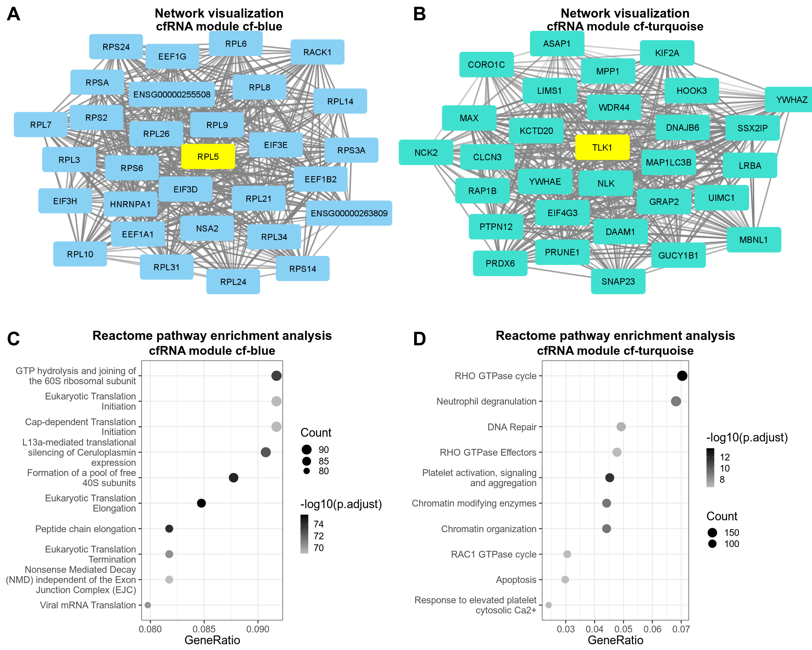
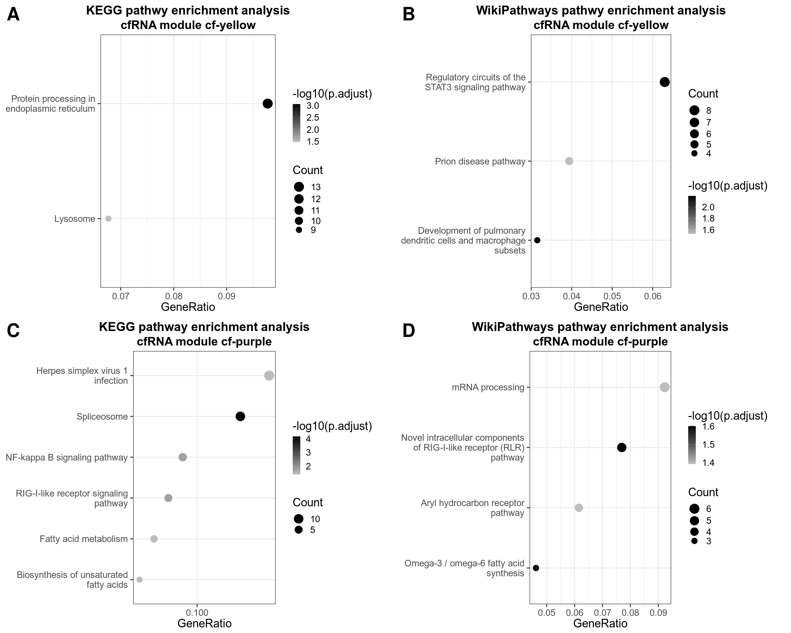

<style type="text/css">
.main-container {
  max-width: 1500px;
  margin-left: auto;
  margin-right: auto;
}
</style>


# load libraries
***


```r
library(dplyr)
library(cowplot)
library(ggplot2)
library(forcats)
library(scales)
library(ReactomePA)
library(org.Hs.eg.db)
library(magick)
library(clusterProfiler)
library(ragg)
library(AnnotationDbi)
```

# Generation of Fig. 2
***


```r
#load cfRNA WGCNA results
load("./cfrna/results/wgcna_main/cfwgcna.RData")
#get gene names and transfer to ENTREZID
module_genes<-data.frame( module = cfmergedcolors, gene = colnames(cfrna_wgcna_input)) 
module_genes_entrez<-AnnotationDbi::select(org.Hs.eg.db,
                              keys = module_genes$gene,
                              keytype = "SYMBOL",
                              columns = c("SYMBOL","ENTREZID")) %>% dplyr::left_join(module_genes,by=c("SYMBOL"="gene"))
#Reactome pathway enrichment analysis and visualization of module cf-turquoise
turq_genes<-module_genes_entrez %>% dplyr::filter(module=="cf-turquoise") %>% na.omit() %>%
  dplyr::select(ENTREZID) %>% unique()
turq_reactome <- enrichPathway(gene= turq_genes$ENTREZID, pvalueCutoff = 0.05)
turq_reactome_df<-fortify(turq_reactome, showCategory = 10) 
turq_reactome_df$p.adjust<- -log10(as.numeric(turq_reactome_df$p.adjust))
turq_reactome_plot<-ggplot(turq_reactome_df, aes(x = GeneRatio, y = fct_reorder(Description, GeneRatio))) +  
  geom_point(aes(size = Count, color = p.adjust))  +  
  scale_size_continuous(range = c(6, 10), breaks = pretty_breaks(n=3)) + 
  scale_colour_gradient(name = "-log10(p.adjust)", low="grey", high="black",  breaks=scales::extended_breaks()) +
  guides(size = guide_legend(reverse=T)) + 
  ylab(NULL) +  
  scale_y_discrete(labels = function(x) stringr::str_wrap(x, width = 30))  +   
  theme_bw(base_size = 26, base_family = "Arial", base_rect_size = 1, base_line_size = 1) +
  theme(plot.title = element_text(color="black", size=28, face="bold", hjust = 0.5),
        plot.subtitle = element_text(color="black", size=27, face="bold", hjust = 0.5)) +
  ggtitle("Reactome pathway enrichment analysis", subtitle = "cfRNA module cf-turquoise")
#Reactome pathway enrichment analysis and visualization of module cf-blue
blue_genes<-module_genes_entrez %>% dplyr::filter(module=="cf-blue") %>% na.omit() %>%
  dplyr::select(ENTREZID) %>% unique()
blue_reactome <- enrichPathway(gene= blue_genes$ENTREZID, pvalueCutoff = 0.05)
blue_reactome_df<-fortify(blue_reactome, showCategory = 10) 
blue_reactome_df$p.adjust<- -log10(as.numeric(blue_reactome_df$p.adjust))
blue_reactome_plot<-ggplot(blue_reactome_df, aes(x = GeneRatio, y = fct_reorder(Description, GeneRatio))) +  
  geom_point(aes(size = Count, color = p.adjust))  +  
  scale_size_continuous(range = c(6, 10), breaks = pretty_breaks(n=3)) + 
  scale_colour_gradient(name = "-log10(p.adjust)", low="grey", high="black",  breaks=scales::extended_breaks()) +
  guides(size = guide_legend(reverse=T)) + 
  ylab(NULL) + 
  scale_y_discrete(labels = function(x) stringr::str_wrap(x, width = 30))  + 
  scale_x_continuous(labels =scales::label_number(accuracy = 0.001), breaks = scales::extended_breaks(n=3)) + 
  theme_bw(base_size = 26, base_family = "Arial", base_rect_size = 1, base_line_size = 1) + 
  theme(plot.title = element_text(color="black", size=28, face="bold", hjust = 0.5),
        plot.subtitle = element_text(color="black", size=27, face="bold", hjust = 0.5)) +
  ggtitle("Reactome pathway enrichment analysis", subtitle = "cfRNA module cf-blue")
#load module representations generated by Cytoscape
blue_module_plot<-draw_image("./cfrna/results/cytoscape/edges_blue.png", width=.5, height=1, x=0, y=0.25, scale = 1.5) 
turq_module_plot<-draw_image("./cfrna/results/cytoscape/edges_turquoise.png", width=.5, height=1, x=0.5, y=0.25, scale=1.5) 
#combine the plots in one image
fig2<-ggdraw() + blue_module_plot + turq_module_plot + draw_plot(blue_reactome_plot, x=0, y=0, width = .5, height=.5) + draw_plot(turq_reactome_plot, x=0.5, y=0, width = .5, height=.5) +  draw_plot_label(label = c("A", "B", "C", "D"), size = 42, x = c(0, 0.5, 0, 0.5), y = c(1, 1, 0.5, 0.5), family = "Arial") + draw_label("Network visualization", size=28, x=0.27, y=0.98, fontface = 'bold', fontfamily = "Arial") + draw_label("cfRNA module cf-blue", size=27, x=0.27, y=0.96, fontface = 'bold', fontfamily = "Arial") + draw_label("Network visualization", size=28, x=0.77, y=0.98, fontface = 'bold', fontfamily = "Arial") + draw_label("cfRNA module cf-turquoise", size=27, x=0.77, y=0.96, fontface = 'bold', fontfamily = "Arial") 
plot(fig2)
```



```r
#save
ggsave(plot=fig2, file="./figures/main_figures/fig2.png", units = "mm", device = ragg::agg_png, height=150, width=180, scaling = 0.3, limitsize = FALSE)
```

# Generation of Supp Fig. 3
***


```r
#for Linux based systems
options(clusterProfiler.download.method = "wget")
#KEGG pathway enrichment analysis and visualization for module cf-turquoise
turq_kegg <- enrichKEGG(gene= turq_genes$ENTREZID, pvalueCutoff = 0.05, organism = 'hsa')
turq_kegg_df<-fortify(turq_kegg, showCategory = 10) 
turq_kegg_df$p.adjust<- -log10(as.numeric(turq_kegg_df$p.adjust))
turq_kegg_plot<-ggplot(turq_kegg_df, aes(x = GeneRatio, y = fct_reorder(Description, GeneRatio))) +  
  geom_point(aes(size = Count, color = p.adjust))  +  
  scale_size_continuous(range = c(6, 10), breaks = pretty_breaks(n=3)) + 
  scale_colour_gradient(name = "-log10(p.adjust)", low="grey", high="black",  breaks=scales::extended_breaks()) +   
  guides(size = guide_legend(reverse=T)) + 
  ylab(NULL) + 
  ggtitle(paste0("KEGG pathway enrichment analysis", "\n", "cfRNA module cf-turquoise")) +  
  scale_y_discrete(labels = function(x) stringr::str_wrap(x, width = 30))  +   
  theme_bw(base_size = 26, base_family = "Arial", base_rect_size = 1, base_line_size = 1) + 
  theme(plot.title = element_text(color="black", size=28, face="bold", hjust = 0.5))
#WikiPathways pathway enrichment analysis and visualization for module cf-turquoise
turq_wp<-enrichWP(turq_genes$ENTREZID, organism = "Homo sapiens") 
turq_wp_df<-fortify(turq_wp, showCategory = 10) 
turq_wp_df$p.adjust<- -log10(as.numeric(turq_wp_df$p.adjust))
turq_wp_plot<-ggplot(turq_wp_df, aes(x = GeneRatio, y = fct_reorder(Description, GeneRatio))) +  
  geom_point(aes(size = Count, color = p.adjust))  +  
  scale_size_continuous(range = c(6, 10), breaks = pretty_breaks(n=3)) + 
  scale_colour_gradient(name = "-log10(p.adjust)", low="grey", high="black",  breaks=scales::extended_breaks()) +  
  guides(size = guide_legend(reverse=T)) + 
  ylab(NULL) + 
  scale_y_discrete(labels = function(x) stringr::str_wrap(x, width = 30))  +   
  theme_bw(base_size = 26, base_family = "Arial", base_rect_size = 1, base_line_size = 1) +
  theme(plot.title = element_text(color="black", size=28, face="bold", hjust = 0.5),
        plot.subtitle = element_text(color="black", size=27, face="bold", hjust = 0.5)) +
  ggtitle("WikiPathways pathway enrichment analysis", subtitle =  "cfRNA module cf-turquoise")
#KEGG pathway enrichment analysis and visualization for module cf-blue
blue_genes<-module_genes_entrez %>% dplyr::filter(module=="cf-blue") %>% na.omit() %>%
  dplyr::select(ENTREZID) %>% unique()
blue_kegg <- enrichKEGG(gene= blue_genes$ENTREZID, pvalueCutoff = 0.05, organism = "hsa")
blue_kegg_df<-fortify(blue_kegg, showCategory = 10) 
blue_kegg_df$p.adjust<- -log10(as.numeric(blue_kegg_df$p.adjust))
blue_kegg_plot<-ggplot(blue_kegg_df, aes(x = GeneRatio, y = fct_reorder(Description, GeneRatio))) +  
  geom_point(aes(size = Count, color = p.adjust))  +  
  scale_size_continuous(range = c(6, 10), breaks = pretty_breaks(n=3)) + 
  scale_colour_gradient(name = "-log10(p.adjust)", low="grey", high="black",  breaks=scales::extended_breaks()) +   
  guides(size = guide_legend(reverse=T)) + 
  ylab(NULL) + 
  scale_y_discrete(labels = function(x) stringr::str_wrap(x, width = 30))  + 
  scale_x_continuous(labels =scales::label_number(accuracy = 0.001), breaks = scales::extended_breaks(n=3)) +   
  theme_bw(base_size = 26, base_family = "Arial", base_rect_size = 1, base_line_size = 1) +
  theme(plot.title = element_text(color="black", size=28, face="bold", hjust = 0.5),
        plot.subtitle = element_text(color="black", size=27, face="bold", hjust = 0.5)) +
  ggtitle("KEGG pathway enrichment analysis", subtitle =  "cfRNA module cf-blue") 
#WikiPathways pathway enrichment analysis and visualization for module cf-blue
blue_wp<-enrichWP(blue_genes$ENTREZID, organism = "Homo sapiens") 
blue_wp_df<-fortify(blue_wp, showCategory = 10) 
blue_wp_df$p.adjust<- -log10(as.numeric(blue_wp_df$p.adjust))
blue_wp_plot<-ggplot(blue_wp_df, aes(x = GeneRatio, y = fct_reorder(Description, GeneRatio))) +  
  geom_point(aes(size = Count, color = p.adjust))  +  
  scale_size_continuous(range = c(6, 10), breaks = pretty_breaks(n=3)) + 
  scale_colour_gradient(name = "-log10(p.adjust)", low="grey", high="black",  breaks=scales::extended_breaks()) +   
  guides(size = guide_legend(reverse=T)) + 
  ylab(NULL) + 
  scale_y_discrete(labels = function(x) stringr::str_wrap(x, width = 30))  +   
  theme_bw(base_size = 26, base_family = "Arial", base_rect_size = 1, base_line_size = 1) + 
  theme(plot.title = element_text(color="black", size=28, face="bold", hjust = 0.5),
        plot.subtitle = element_text(color="black", size=27, face="bold", hjust = 0.5)) +
  ggtitle("WikiPathways pathway enrichment analysis", subtitle = "cfRNA module cf-blue") 
#combine plots
supp_fig3<-ggdraw() + draw_plot(blue_kegg_plot, x=0, y=0.5, width = .5, height=.5) + draw_plot(blue_wp_plot, x=0.5, y=0.5, width = .5, height=.5) + draw_plot(turq_kegg_plot, x=0, y=0, width = .5, height=.5) + draw_plot(turq_wp_plot, x=0.5, y=0, width = .5, height=.5) +  draw_plot_label(label = c("A", "B", "C", "D"), size = 42, x = c(0, 0.5, 0, 0.5), y = c(1, 1, 0.5, 0.5), family = "Arial")  
plot(supp_fig3)
```



```r
dir.create("./figures/supp_figures/")
#save
ggsave(plot=supp_fig3, file="./figures/supp_figures/supp_fig3.png", units = "mm", device = ragg::agg_png, height=150, width=180, scaling = 0.3, limitsize = FALSE)
```


```r
sessionInfo()
```

```
## R version 4.1.2 (2021-11-01)
## Platform: x86_64-pc-linux-gnu (64-bit)
## Running under: Ubuntu 22.04 LTS
## 
## Matrix products: default
## BLAS:   /usr/lib/x86_64-linux-gnu/blas/libblas.so.3.10.0
## LAPACK: /usr/lib/x86_64-linux-gnu/lapack/liblapack.so.3.10.0
## 
## locale:
##  [1] LC_CTYPE=en_US.UTF-8       LC_NUMERIC=C              
##  [3] LC_TIME=de_DE.UTF-8        LC_COLLATE=en_US.UTF-8    
##  [5] LC_MONETARY=de_DE.UTF-8    LC_MESSAGES=en_US.UTF-8   
##  [7] LC_PAPER=de_DE.UTF-8       LC_NAME=C                 
##  [9] LC_ADDRESS=C               LC_TELEPHONE=C            
## [11] LC_MEASUREMENT=de_DE.UTF-8 LC_IDENTIFICATION=C       
## 
## attached base packages:
## [1] stats4    stats     graphics  grDevices utils     datasets  methods  
## [8] base     
## 
## other attached packages:
##  [1] ragg_1.2.2            clusterProfiler_4.2.2 magick_2.7.3         
##  [4] org.Hs.eg.db_3.14.0   AnnotationDbi_1.56.2  IRanges_2.28.0       
##  [7] S4Vectors_0.32.4      Biobase_2.54.0        BiocGenerics_0.40.0  
## [10] ReactomePA_1.38.0     scales_1.2.0          forcats_0.5.1        
## [13] ggplot2_3.3.6         cowplot_1.1.1         dplyr_1.0.9          
## 
## loaded via a namespace (and not attached):
##   [1] fgsea_1.20.0           colorspace_2.0-3       ggtree_3.2.1          
##   [4] ellipsis_0.3.2         qvalue_2.26.0          XVector_0.34.0        
##   [7] aplot_0.1.6            rstudioapi_0.13        farver_2.1.0          
##  [10] graphlayouts_0.8.0     ggrepel_0.9.1          bit64_4.0.5           
##  [13] fansi_1.0.3            scatterpie_0.1.7       splines_4.1.2         
##  [16] cachem_1.0.6           GOSemSim_2.20.0        knitr_1.39            
##  [19] polyclip_1.10-0        jsonlite_1.8.0         GO.db_3.14.0          
##  [22] png_0.1-7              graph_1.72.0           ggforce_0.3.3         
##  [25] graphite_1.40.0        compiler_4.1.2         httr_1.4.3            
##  [28] backports_1.4.1        assertthat_0.2.1       Matrix_1.4-0          
##  [31] fastmap_1.1.0          lazyeval_0.2.2         cli_3.3.0             
##  [34] tweenr_1.0.2           htmltools_0.5.2        tools_4.1.2           
##  [37] igraph_1.3.1           gtable_0.3.0           glue_1.6.2            
##  [40] GenomeInfoDbData_1.2.7 reshape2_1.4.4         DO.db_2.9             
##  [43] rappdirs_0.3.3         fastmatch_1.1-3        Rcpp_1.0.8.3          
##  [46] enrichplot_1.14.2      jquerylib_0.1.4        vctrs_0.4.1           
##  [49] Biostrings_2.62.0      ape_5.6-2              nlme_3.1-155          
##  [52] ggraph_2.0.5           xfun_0.31              stringr_1.4.0         
##  [55] lifecycle_1.0.1        DOSE_3.20.1            zlibbioc_1.40.0       
##  [58] MASS_7.3-55            tidygraph_1.2.1        reactome.db_1.77.0    
##  [61] parallel_4.1.2         RColorBrewer_1.1-3     yaml_2.3.5            
##  [64] memoise_2.0.1          gridExtra_2.3          downloader_0.4        
##  [67] ggfun_0.0.6            yulab.utils_0.0.4      sass_0.4.1            
##  [70] stringi_1.7.6          RSQLite_2.2.14         highr_0.9             
##  [73] tidytree_0.3.9         checkmate_2.1.0        BiocParallel_1.28.3   
##  [76] GenomeInfoDb_1.30.1    systemfonts_1.0.4      rlang_1.0.2           
##  [79] pkgconfig_2.0.3        bitops_1.0-7           evaluate_0.15         
##  [82] lattice_0.20-45        purrr_0.3.4            labeling_0.4.2        
##  [85] treeio_1.18.1          patchwork_1.1.1        shadowtext_0.1.2      
##  [88] bit_4.0.4              tidyselect_1.1.2       plyr_1.8.7            
##  [91] magrittr_2.0.3         R6_2.5.1               generics_0.1.2        
##  [94] DBI_1.1.2              pillar_1.7.0           withr_2.5.0           
##  [97] KEGGREST_1.34.0        RCurl_1.98-1.7         tibble_3.1.7          
## [100] crayon_1.5.1           utf8_1.2.2             rmarkdown_2.14        
## [103] viridis_0.6.2          grid_4.1.2             data.table_1.14.2     
## [106] blob_1.2.3             digest_0.6.29          tidyr_1.2.0           
## [109] textshaping_0.3.6      gridGraphics_0.5-1     munsell_0.5.0         
## [112] viridisLite_0.4.0      ggplotify_0.1.0        bslib_0.3.1
```
