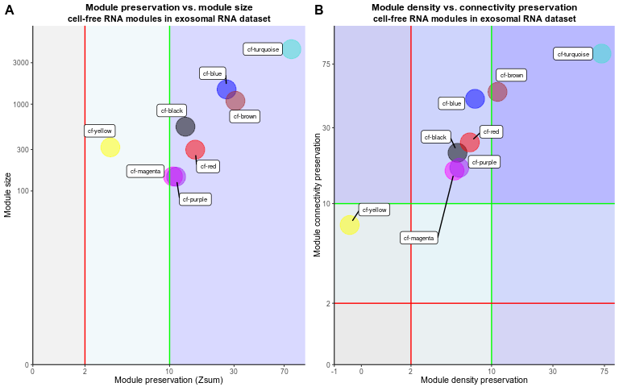

<style type="text/css">
.main-container {
  max-width: 1500px;
  margin-left: auto;
  margin-right: auto;
}
</style>

# load libraries
***


```r
library(forcats)
library(dplyr)
library(WGCNA)
library(cowplot)
library(ggplot2)
library(RColorBrewer)
library(tibble)
library(ggrepel)
library(tidyr)
library(stringr)
library(cowplot)
```

# Module presevation calculation (cfRNA modules => exoRNA data)
***


```r
enableWGCNAThreads(nThreads=8) 
load("./cfrna/results/wgcna_main/cfwgcna.RData")
load("./exorna/results/wgcna_main/exowgcna.RData")
setLabels <- c("cfRNA", "exoRNA") 
multiExpr <- list(cfRNA = list(data = cfrna_wgcna_input), exoRNA = list(data = exorna_wgcna_input))
multiColor <- list(cfRNA = cfmergedcolors)
mp_cf_exo <- modulePreservation(multiExpr, multiColor, referenceNetworks = 1, nPermutations = 100, randomSeed = 1, quickCor = 0, maxModuleSize=5000, maxGoldModuleSize=5000, parallelCalculation=T)
```

# Generation of Figure 3 
***


```r
load("./cfrna/results/mp_cf_exo/mp_cf_exo.RData")
#get module size and Zsum connectivity statistics 
ref <-  1
test <- 2
modColors <- rownames(mp_cf_exo$preservation$observed[[ref]][[test]])
moduleSizes <-  mp_cf_exo$preservation$Z[[ref]][[test]][, 1]
plotData <- cbind(mp_cf_exo$preservation$observed[[ref]][[test]][, 2], mp_cf_exo$preservation$Z[[ref]][[test]][, 2])
df<-as.data.frame(plotData)
df$mod<-modColors
df<-df[ , 2:3]
df$size<-moduleSizes
# leave grey and gold modules out
df_input<-df %>% 
  filter(!mod %in% c("gold", "grey")) %>% mutate(col=str_remove(mod, "cf-"))
rects <- data.frame(xstart = c(0, 2, 10), xend = c(2, 10, 100), col = letters[1:3])
mp1<-ggplot() + 
  geom_rect(data = rects, aes(xmin = xstart, xmax = xend, ymin = 0, ymax = 8000, fill=col), alpha = 0.15,) +  
  scale_fill_manual(values=c("darkgrey", "lightblue", "blue")) + 
  geom_point(data=df_input, aes(x=V2, y=size, colour=col), size=8, alpha=0.5) + 
  geom_vline(xintercept = 2, colour="red") + 
  geom_vline(xintercept = 10, colour="green") +
  theme_classic(base_size = 8) +  
  scale_colour_identity() +
  geom_label_repel(data = df_input,
                   aes(x=V2, y=size, label=mod),
                   box.padding   = 0.5, 
                   point.padding = 0.5,
                   segment.color = 'black',
                   max.overlaps = Inf,
                   size=2,
                   segment.size=0.5,force=50)  +
  scale_x_continuous(trans='pseudo_log', expand = c(0, 0), breaks=c(0, 2, 10, 30, 70)) +
  scale_y_continuous(trans='pseudo_log', expand = c(0, 0), breaks = c(0, 100, 300, 1000, 3000), limits = c(0, 8000)) +
  labs(x = "Module preservation (Zsum)", y = "Module size", title="Module preservation vs. module size", subtitle = "cell-free RNA modules in exosomal RNA dataset")  +
  theme(text=element_text(family="Arial"), plot.title = element_text(color="black", size=9, face="bold", hjust = 0.5), plot.subtitle = element_text(color="black", size=8, face="bold", hjust = 0.5), legend.position="none")
#get Zconnectiviy and Zdensity preservation statistics
mp_data<-data.frame(density=mp_cf_exo$preservation$Z$ref.cfRNA$inColumnsAlsoPresentIn.exoRNA$Zdensity.pres, connectivity=mp_cf_exo$preservation$Z$ref.cfRNA$inColumnsAlsoPresentIn.exoRNA$Zconnectivity.pres, modules= rownames(mp_cf_exo$preservation$observed[[ref]][[test]])) %>% 
  filter(., !(modules %in% c("grey", "gold")) ) %>% 
  mutate(col=str_remove(modules, "cf-"))
rects <- data.frame(xstart = c(-1, 2, 10, -1, -1, -1), xend = c(2, 10, 90, 90, 90, 90), ystart=c(0, 0, 0, 0, 2, 10) , yend=c(130, 130, 130, 2, 10, 130) , col = letters[1:6])
mp2<-ggplot() + 
  geom_rect(data = rects, aes(xmin = xstart, xmax = xend, ymin = ystart, ymax = yend, fill=col), alpha = 0.15,) +  
  scale_fill_manual(values=c("darkgrey", "lightblue", "blue", "grey", "lightblue", "blue")) +
  geom_point(data=mp_data, aes(x=density, y=connectivity, colour=col), size=8, alpha=0.5) +
  geom_vline(xintercept = 2, colour="red") + geom_vline(xintercept = 10, colour="green") +
  geom_hline(yintercept = 2, colour="red") + geom_hline(yintercept = 10, colour="green") +
  theme_classic(base_size = 8) +  scale_colour_identity() +scale_x_continuous(trans='pseudo_log', limits = c(-1,90), expand = c(0, 0), breaks=c(-1, 0, 2, 10, 30, 75)) +
  scale_y_continuous(trans='pseudo_log', limits = c(0,130), expand = c(0, 0), breaks = c(0, 2, 10, 30, 75)) +
  geom_label_repel(data = mp_data,
                   aes(x=density, y=connectivity, label=modules),
                   box.padding   = 0.5, 
                   point.padding = 0.5,
                   segment.color = 'black',
                   max.overlaps = Inf,
                   size=2,
                   segment.size=0.5,force=50)   +
  labs(x = "Module density preservation", y = "Module connectivity preservation", title="Module density vs. connectivity preservation", subtitle = "cell-free RNA modules in exosomal RNA dataset") +
  theme(text=element_text(family="Arial"), plot.title = element_text(color="black", size=9, face="bold", hjust = 0.5), plot.subtitle = element_text(color="black", size=8, face="bold", hjust = 0.5), legend.position="none")
#combine
fig3<-ggdraw(ylim=c(0.5, 1), clip = "on") +
  draw_plot(mp1, x = 0, y = 0.5, height=.5, width=.5) +
  draw_plot(mp2, x = .5, y = 0.5, height=.5, width = .5) +
  draw_plot_label(label = c("A", "B"), size = 12,
                  x = c(0, 0.5), y = c(1, 1), family = "Arial") 
fig3
```



```r
ggsave(plot=fig3, "./plots/main_plots/fig3.png", scale=1, units = "mm", width=180, height=70)
```

# Module presevation calculation (exoRNA modules => cfRNA data)
***


```r
enableWGCNAThreads(nThreads=8) 
setLabels <- c("exoRNA", "cfRNA")
multiExpr <- list(exorRNA = list(data = exorna_wgcna_input), cfRNA = list(data = cfrna_wgcna_input) )
multiColor <- list(exoRNA = exomergedcolors)
mp_exo_cf <- modulePreservation(multiExpr, multiColor, referenceNetworks = 1, nPermutations = 100, randomSeed = 1, quickCor = 0, maxModuleSize=5500, maxGoldModuleSize=5500, parallelCalculation=T)
```

# Generation of Supp. Figure 4
***


```r
load("./exorna/results/mp_exo_cf/mp_exo_cf.RData")
#get module size and Zsum connectivity statistics 
ref <-  1
test <- 2
modColors <- rownames(mp_exo_cf$preservation$observed[[ref]][[test]])
moduleSizes <-  mp_exo_cf$preservation$Z[[ref]][[test]][, 1]
plotData <- cbind(mp_exo_cf$preservation$observed[[ref]][[test]][, 2], mp_exo_cf$preservation$Z[[ref]][[test]][, 2])
df<-as.data.frame(plotData)
df$mod<-modColors
df<-df[ , 2:3]
df$size<-moduleSizes
# leave grey and gold modules out
df_input<- df %>% 
  filter(!mod %in% c("gold", "grey")) %>% 
  mutate(col=str_remove(mod, "exo-"))
rects <- data.frame(xstart = c(0, 2, 10), xend = c(2, 10, 100), col = letters[1:3])
supp_fig4<-ggplot() + 
  geom_rect(data = rects, aes(xmin = xstart, xmax = xend, ymin = 0, ymax = 8000, fill=col), alpha = 0.15,) +  
  scale_fill_manual(values=c("darkgrey", "lightblue", "blue")) + 
  geom_point(data=df_input, aes(x=V2, y=size, colour=col), size=8, alpha=0.5) + 
  geom_vline(xintercept = 2, colour="red") + 
  geom_vline(xintercept = 10, colour="green") +
  theme_classic(base_size = 8) +  
  scale_colour_identity() +
  geom_label_repel(data = df_input,
                   aes(x=V2, y=size, label=mod),
                   box.padding   = 0.5, 
                   point.padding = 0.5,
                   segment.color = 'black',
                   max.overlaps = Inf,
                   size=2,
                   segment.size=0.5,force=50)  +
  scale_x_continuous(trans='pseudo_log', expand = c(0, 0), breaks=c(0, 2, 10, 30, 70)) +
  scale_y_continuous(trans='pseudo_log', expand = c(0, 0), breaks = c(0, 100, 300, 1000, 3000), limits = c(0, 8000)) +
  labs(x = "Module preservation (Zsum)", y = "Module size", title="Module preservation vs. module size", subtitle = "exosome RNA modules in cell-free RNA dataset")  +
  theme(text=element_text(family="Arial"), plot.title = element_text(color="black", size=9, face="bold", hjust = 0.5), plot.subtitle = element_text(color="black", size=8, face="bold", hjust = 0.5), legend.position="none")
supp_fig4
```


```r
dir.create("./exorna/plots/supp_plots/", recursive = T)
ggsave(plot=supp_fig4, "./plots/supp_plots/supp_fig4.png", scale=1, units = "mm", width=180, height=100)
```


```r
sessionInfo()
```

```
## R version 4.1.2 (2021-11-01)
## Platform: x86_64-pc-linux-gnu (64-bit)
## Running under: Ubuntu 22.04 LTS
## 
## Matrix products: default
## BLAS:   /usr/lib/x86_64-linux-gnu/blas/libblas.so.3.10.0
## LAPACK: /usr/lib/x86_64-linux-gnu/lapack/liblapack.so.3.10.0
## 
## locale:
##  [1] LC_CTYPE=en_US.UTF-8       LC_NUMERIC=C              
##  [3] LC_TIME=de_DE.UTF-8        LC_COLLATE=en_US.UTF-8    
##  [5] LC_MONETARY=de_DE.UTF-8    LC_MESSAGES=en_US.UTF-8   
##  [7] LC_PAPER=de_DE.UTF-8       LC_NAME=C                 
##  [9] LC_ADDRESS=C               LC_TELEPHONE=C            
## [11] LC_MEASUREMENT=de_DE.UTF-8 LC_IDENTIFICATION=C       
## 
## attached base packages:
## [1] stats     graphics  grDevices utils     datasets  methods   base     
## 
## other attached packages:
##  [1] stringr_1.4.0         tidyr_1.2.0           ggrepel_0.9.1        
##  [4] tibble_3.1.7          RColorBrewer_1.1-3    ggplot2_3.3.6        
##  [7] cowplot_1.1.1         WGCNA_1.71            fastcluster_1.2.3    
## [10] dynamicTreeCut_1.63-1 dplyr_1.0.9           forcats_0.5.1        
## 
## loaded via a namespace (and not attached):
##  [1] bitops_1.0-7           matrixStats_0.62.0     bit64_4.0.5           
##  [4] doParallel_1.0.17      httr_1.4.3             GenomeInfoDb_1.30.1   
##  [7] tools_4.1.2            backports_1.4.1        bslib_0.3.1           
## [10] utf8_1.2.2             R6_2.5.1               rpart_4.1.16          
## [13] Hmisc_4.7-0            DBI_1.1.2              BiocGenerics_0.40.0   
## [16] colorspace_2.0-3       nnet_7.3-17            withr_2.5.0           
## [19] tidyselect_1.1.2       gridExtra_2.3          preprocessCore_1.56.0 
## [22] bit_4.0.4              compiler_4.1.2         textshaping_0.3.6     
## [25] cli_3.3.0              Biobase_2.54.0         htmlTable_2.4.0       
## [28] labeling_0.4.2         sass_0.4.1             scales_1.2.0          
## [31] checkmate_2.1.0        systemfonts_1.0.4      digest_0.6.29         
## [34] foreign_0.8-82         rmarkdown_2.14         XVector_0.34.0        
## [37] base64enc_0.1-3        jpeg_0.1-9             pkgconfig_2.0.3       
## [40] htmltools_0.5.2        highr_0.9              fastmap_1.1.0         
## [43] htmlwidgets_1.5.4      rlang_1.0.2            rstudioapi_0.13       
## [46] RSQLite_2.2.14         impute_1.68.0          farver_2.1.0          
## [49] jquerylib_0.1.4        generics_0.1.2         jsonlite_1.8.0        
## [52] RCurl_1.98-1.7         magrittr_2.0.3         GO.db_3.14.0          
## [55] GenomeInfoDbData_1.2.7 Formula_1.2-4          Matrix_1.4-0          
## [58] Rcpp_1.0.8.3           munsell_0.5.0          S4Vectors_0.32.4      
## [61] fansi_1.0.3            lifecycle_1.0.1        stringi_1.7.6         
## [64] yaml_2.3.5             zlibbioc_1.40.0        grid_4.1.2            
## [67] blob_1.2.3             parallel_4.1.2         crayon_1.5.1          
## [70] lattice_0.20-45        Biostrings_2.62.0      splines_4.1.2         
## [73] KEGGREST_1.34.0        knitr_1.39             pillar_1.7.0          
## [76] codetools_0.2-18       stats4_4.1.2           glue_1.6.2            
## [79] evaluate_0.15          latticeExtra_0.6-29    data.table_1.14.2     
## [82] png_0.1-7              vctrs_0.4.1            foreach_1.5.2         
## [85] gtable_0.3.0           purrr_0.3.4            assertthat_0.2.1      
## [88] cachem_1.0.6           xfun_0.31              ragg_1.2.2            
## [91] survival_3.2-13        iterators_1.0.14       AnnotationDbi_1.56.2  
## [94] memoise_2.0.1          IRanges_2.28.0         cluster_2.1.2         
## [97] ellipsis_0.3.2
```
