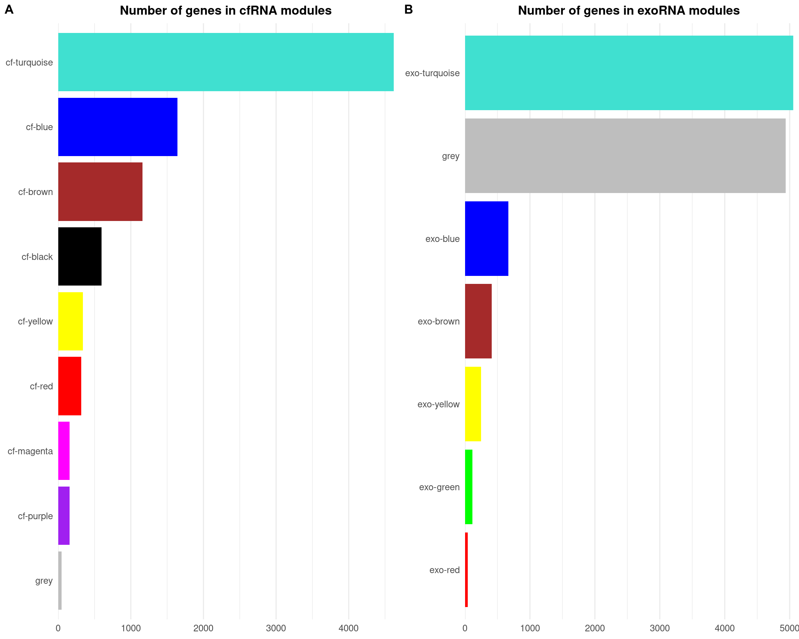
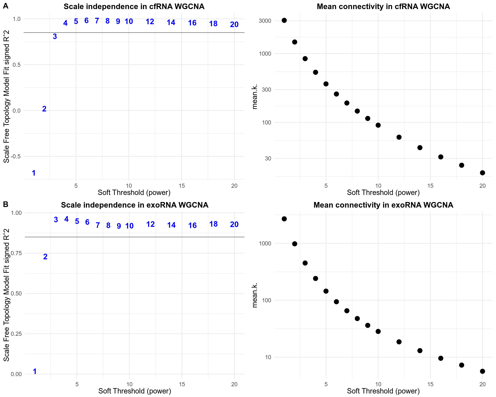

<style type="text/css">
.main-container {
  max-width: 1500px;
  margin-left: auto;
  margin-right: auto;
}
</style>

# load libraries
***


```r
library(dplyr)
library(cowplot)
library(ggplot2)
library(forcats)
library(scales)
library(magick)
library(ragg)
```

# Generation of Supplementary Figure 1
***


```r
load("./cfrna/results/wgcna_main/cfwgcna.RData")
load("./exorna/results/wgcna_main/exowgcna.RData")
supp_fig2<-ggdraw() + draw_plot(cfrna_bar, x=0, y=0, width = .5, height=1) + draw_plot(exorna_bar, x=0.5, y=0, width = .5, height=1) +  draw_plot_label(label = c("A", "B"), size = 28, x = c(0, 0.5), y = c(1, 1), family = "Arial") 
plot(supp_fig2)
```



```r
dir.create("./plots/supp_plots/", recursive = T)
#save
ggsave(plot=supp_fig2, file="./plots/supp_plots/supp_fig2.png", units = "mm", device = ragg::agg_png, height=80, width=180, scaling = 0.3, limitsize = FALSE)
```

# Generation of Supplementary Figure 2
***


```r
supp_fig1<-ggdraw() + draw_plot(cfrna_param, x=0, y=0.5, width = 1, height=.5) + draw_plot(exorna_param, x=0, y=0, width = 1, height=.5) +  draw_plot_label(label = c("A", "B"), size = 28, x = c(0, 0), y = c(1, 0.5), family = "Arial") 
plot(supp_fig1)
```



```r
#save
ggsave(plot=supp_fig1, file="./plots/supp_plots/supp_fig1.png", units = "mm", device = ragg::agg_png, height=150, width=180, scaling = 0.3, limitsize = FALSE)
```


```r
sessionInfo()
```

```
## R version 4.1.2 (2021-11-01)
## Platform: x86_64-pc-linux-gnu (64-bit)
## Running under: Ubuntu 22.04 LTS
## 
## Matrix products: default
## BLAS:   /usr/lib/x86_64-linux-gnu/blas/libblas.so.3.10.0
## LAPACK: /usr/lib/x86_64-linux-gnu/lapack/liblapack.so.3.10.0
## 
## locale:
##  [1] LC_CTYPE=en_US.UTF-8       LC_NUMERIC=C              
##  [3] LC_TIME=de_DE.UTF-8        LC_COLLATE=en_US.UTF-8    
##  [5] LC_MONETARY=de_DE.UTF-8    LC_MESSAGES=en_US.UTF-8   
##  [7] LC_PAPER=de_DE.UTF-8       LC_NAME=C                 
##  [9] LC_ADDRESS=C               LC_TELEPHONE=C            
## [11] LC_MEASUREMENT=de_DE.UTF-8 LC_IDENTIFICATION=C       
## 
## attached base packages:
## [1] stats     graphics  grDevices utils     datasets  methods   base     
## 
## other attached packages:
## [1] ragg_1.2.2    magick_2.7.3  scales_1.2.0  forcats_0.5.1 ggplot2_3.3.6
## [6] cowplot_1.1.1 dplyr_1.0.9  
## 
## loaded via a namespace (and not attached):
##  [1] Rcpp_1.0.8.3      highr_0.9         pillar_1.7.0      bslib_0.3.1      
##  [5] compiler_4.1.2    jquerylib_0.1.4   tools_4.1.2       digest_0.6.29    
##  [9] jsonlite_1.8.0    evaluate_0.15     lifecycle_1.0.1   tibble_3.1.7     
## [13] gtable_0.3.0      pkgconfig_2.0.3   rlang_1.0.2       cli_3.3.0        
## [17] DBI_1.1.2         rstudioapi_0.13   yaml_2.3.5        xfun_0.31        
## [21] fastmap_1.1.0     withr_2.5.0       stringr_1.4.0     knitr_1.39       
## [25] systemfonts_1.0.4 generics_0.1.2    vctrs_0.4.1       sass_0.4.1       
## [29] grid_4.1.2        tidyselect_1.1.2  glue_1.6.2        R6_2.5.1         
## [33] textshaping_0.3.6 fansi_1.0.3       rmarkdown_2.14    farver_2.1.0     
## [37] purrr_0.3.4       magrittr_2.0.3    ellipsis_0.3.2    htmltools_0.5.2  
## [41] assertthat_0.2.1  colorspace_2.0-3  labeling_0.4.2    utf8_1.2.2       
## [45] stringi_1.7.6     munsell_0.5.0     crayon_1.5.1
```
